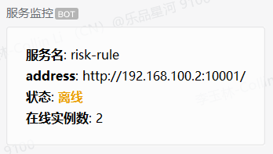
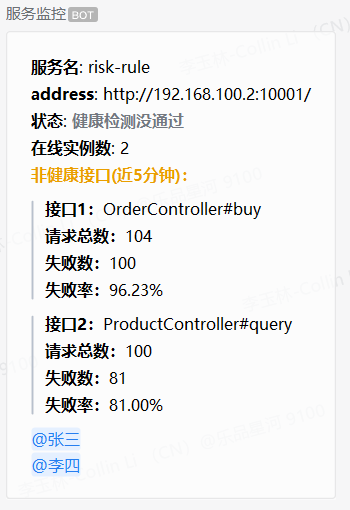
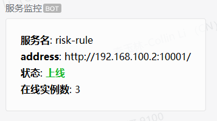

smart cloud
---
[](https://github.com/smart-cloud/smart-cloud/actions/workflows/build.yml)
[](https://codecov.io/gh/smart-cloud/smart-cloud)
[](https://github.com/smart-cloud/smart-cloud/blob/dev/LICENSE)
[](https://mvnrepository.com/artifact/io.github.smart-cloud/smart-cloud)
[](https://github.com/smart-cloud/smart-cloud/blob/dev/README_EN.md)
[](https://github.com/smart-cloud/smart-cloud#readme)
# 一、功能特征

**一个基于spring cloud实现的脚手架。所实现功能如下：**

- [接口文档自动生成（利用idea yapi插件上传到yapi server）](https://github.com/smart-cloud/smart-cloud#%E4%BA%94%E6%8E%A5%E5%8F%A3%E6%96%87%E6%A1%A3)
- [可以生成mock数据，充分发挥前后端分离的作用](https://github.com/smart-cloud/smart-cloud?tab=readme-ov-file#%E5%9B%9B%E6%8E%A5%E5%8F%A3mock%E6%95%B0%E6%8D%AE)
- [部署灵活，服务可合并（合并后服务间通过内部进程通信；分开后通过rpc通信）部署，合并后也可拆分开部署](https://github.com/smart-cloud/smart-cloud#%E5%9B%9B%E6%9C%8D%E5%8A%A1%E5%90%88%E5%B9%B6%E5%8E%9F%E7%90%86)
- 业务无关代码自动生成
- [接口支持加密与签名](https://github.com/smart-cloud/smart-cloud-examples#%E4%BA%8C%E6%8E%A5%E5%8F%A3%E5%AE%89%E5%85%A8)
- 业务无关功能（如日志打印、公共配置、常用工具类等）抽象为starter
- 支持web接口日志、feign日志、method注解日志、mybatis日志、mq消费者日志打印，日志级别可配置
- 支持多数据源、分表分库
- 支持多语言（国际化）
- 敏感配置信息支持加密，表隐私字段加解密（支持多秘钥）
- 接口限流，支持配置中心动态刷新
- 接口多版本控制
- 分布式锁注解，缓存注解
- mq（rabbitmq）消费失败，通过自定义注解实现重试（放入延迟队列重新消费）
- 服务监控，接口异常监控
- [日志敏感数据脱敏](https://github.com/smart-cloud/smart-cloud#%E4%BA%8C%E6%97%A5%E5%BF%97%E6%95%B0%E6%8D%AE%E8%84%B1%E6%95%8F)
- 单体服务开发接阶段测试不依赖其他服务（mock test、关闭nacos、sentinel等）

示例工程见[smart-cloud-examples](https://github.com/smart-cloud/smart-cloud-examples)

# 二、模块说明

```
smart-cloud
├──smart-api-core -- 接口权限、加解密、签名等注解 && 用户上下文
│  ├──smart-api-annotation -- 接口权限、加解密、签名等注解
│  └──smart-user-context -- 用户上下文
├──smart-code-generate -- 代码生成
├──smart-common-pojo -- 公共对象（VO、DTO、BO、DO等）
├──smart-common-web -- web模块公共处理
├──smart-constants -- 常量模块
├──smart-exception -- 异常模块
├──smart-mask -- 敏感数据混淆
├──smart-test -- test封装
│  ├──smart-cloud-starter-test -- test封装
│  ├──smart-cloud-starter-test-mock-rabbitmq -- test rabbitmq模块封装
│  ├──smart-cloud-starter-test-mock-redis -- test redis模块封装
│  └──smart-cloud-test-core -- test 单元测试、集成测试封装
├──smart-utility -- 工具类
└──smart-could-starter -- 框架封装
   ├──smart-cloud-starter-api-version -- 接口多版本控制
   ├──smart-cloud-starter-configure -- 框架配置属性封装
   ├──smart-cloud-starter-core -- 框架核心（自定义注解、异常封装、请求响应公共参数、业务相关工具类）
   ├──smart-cloud-starter-elasticsearch-dynamic-datasource -- elasticsearch动态数据源
   ├──smart-cloud-starter-feign -- feign封装（可拆可合、切面处理）
   ├──smart-cloud-starter-global-id -- 分布式id生成器
   ├──smart-cloud-starter-job -- 定时任务封装
   ├──smart-cloud-starter-locale -- 国际化封装
   ├──smart-cloud-starter-log4j2 -- 日志封装（log4j2日志打印，支持日志敏感数据脱敏）
   ├──smart-cloud-starter-logback -- 日志封装（logback日志打印，支持日志敏感数据脱敏）
   ├──smart-cloud-starter-method-log -- 方法切面日志封装
   ├──smart-cloud-starter-mock -- mock封装（mock工具类、常用mock策略、请求接口mock拦截器）
   ├──smart-cloud-starter-mp-shardingjdbc -- mybatis plus、dynamic-datasource、shardingjdbc封装（支持多数据源、分库分表；mapper工具类）
   ├──smart-cloud-starter-mybatis-plus -- mybatis plus、dynamic-datasource封装（支持多数据源；mapper工具类、表隐私字段加解密等）
   ├──smart-cloud-starter-rabbitmq -- rabbitmq封装（消费失败，自动放入延迟队列重新消费）
   ├──smart-cloud-starter-rate-limit -- 接口限流
   ├──smart-cloud-starter-redis -- redis封装、自定义分布式锁注解
   ├──smart-cloud-starter-web -- web封装（日志切面、异常处理、参数校验）
   └──smart-cloud-starter-monitor -- 服务监控，接口监控
      ├──smart-cloud-monitor-common -- 监控公共代码
      ├──smart-cloud-starter-monitor-api -- 接口异常监控
      └──smart-cloud-starter-monitor-admin -- spring boot admin监控，企业微信发通知
```

# 三、技术栈

名称 | 说明
---|---
[spring boot](https://spring.io/projects/spring-boot/) | 手脚架
[spring cloud gateway](https://spring.io/projects/spring-cloud-gateway) | 服务网关
[nacos](https://nacos.io/zh-cn/docs/what-is-nacos.html) | 服务注册、配置中心
[spring boot admin](https://github.com/codecentric/spring-boot-admin) | 服务监控
[openfeign](https://spring.io/projects/spring-cloud-openfeign)| 声明式服务调用
[sleuth](https://spring.io/projects/spring-cloud-sleuth)、[log4j2](https://logging.apache.org/log4j/2.x/) | 链路追踪、日志
[mybatis](http://www.mybatis.org/mybatis-3/zh/index.html) 、[mybatis plus](https://github.com/baomidou/mybatis-plus)| ORM
[dynamic-datasource](https://mp.baomidou.com/guide/dynamic-datasource.html)| 多数据源
[sharding jdbc](https://github.com/apache/incubator-shardingsphere) | 分库分表
[redis](https://redis.io/)、[embedded-redis](https://github.com/kstyrc/embedded-redis) | 缓存、集成测试
[sentinel](https://github.com/alibaba/Sentinel) | 限流、熔断降级
[rabbitmq](https://www.rabbitmq.com/) | 消息队列
[fastdfs](https://github.com/happyfish100/fastdfs) | 文件存储
[xxl-job](https://github.com/xuxueli/xxl-job)| 定时任务
[easyexcel](https://github.com/alibaba/easyexcel) | excel导入导出
[Hibernator-Validator](http://hibernate.org/validator/) | 参数校验
[mockito](https://site.mockito.org/)、[podam](https://github.com/mtedone/podam) | 单元测试、数据mock
[h2](http://www.h2database.com/html/tutorial.html) | 数据库集成测试
[embedded-redis](https://github.com/ozimov/embedded-redis) | redis集成测试
[rabbitmq-mock](https://github.com/fridujo/rabbitmq-mock) | rabbitmq集成测试
[embedded-elasticsearch](https://github.com/allegro/embedded-elasticsearch) | elasticsearch集成测试
[freemarker](https://freemarker.apache.org/) | 用于代码生成
[yapi](https://github.com/YMFE/yapi)、[idea yapi upload plugin](https://github.com/smart-cloud/yapi_upload) | 接口文档
[jasypt-spring-boot](https://github.com/ulisesbocchio/jasypt-spring-boot) | 配置文件中敏感数据加解密
[Lombok](https://www.projectlombok.org/) | 简化代码

# 四、服务合并原理


- 合并服务只需修改pom.xml，将待合并的服务import进去即可。
- rpc接口通过自定义注解[SmartFeignClient](https://github.com/smart-cloud/smart-cloud/blob/dev/smart-cloud-starter/smart-cloud-starter-feign/src/main/java/org/smartframework/cloud/starter/rpc/feign/annotation/SmartFeignClient.java)实现。单个服务独自部署时，FeignClient会生效；当服务提供者和服务消费者合并部署时，FeignClient注解会失效，此时rpc接口将通过实现类对象直接调用。具体逻辑见[SmartFeignClientCondition](https://github.com/smart-cloud/smart-cloud/blob/463cc09b6c2f8a0b947f0a2fcc157ee037ba419d/smart-cloud-starter/smart-cloud-starter-feign/src/main/java/org/smartframework/cloud/starter/rpc/feign/condition/SmartFeignClientCondition.java#L32)。

# 五、相关说明

## （一）服务合并遇到的问题

单个服务以jar的形式，通过maven引入合并服务中。在单体服务中，feign接口通过http请求；服务合并后，feign接口通过内部进程的方式通信。

### 1、bean名称冲突

```
不同服务合并打一起后，会存在bean名称冲突的问题。通过自定义bean名称生成规则解决。
```

### 2、rpc与rpc实现类冲突

```
自定义条件注解封装FeignClient。使其在单体服务时，rpc走feign；在合体服务时，rpc走内部进程通信。
```

### 3、yaml文件的自动加载

```
自定义注解YamlScan，用来加载配置的yaml文件（支持正则匹配）。通过SPI机制，在spring.factories文件中添加EnvironmentPostProcessor的实现类，通过其方法参数SpringApplication获取启动类的信息，从而获取YamlScan注解配置的yaml文件信息。然后将yaml文件加到ConfigurableEnvironment中。
```

### 4、启动类注解冲突

```
自定义条件注解SmartSpringCloudApplicationCondition，只会让启动类标记的启动注解生效。
```

### 5、maven打包异常

```
合体服务打包时，单体服务依赖的包也打进单体服务jar。通过maven profiles解决
```

## （二）日志数据脱敏

```
1.从日志侧切入，自定义标签，打印日志时进行脱敏处理；
2.自定义jackson的序列化器；打印日志时，采用自定义的序列化器；
3.通过反射获取log传入参数的MaskRule注解信息，最终根据注解规则进行字符串的截取与替换。
```

## （三）服务监控
通过springboot admin监控服务状态，通过扩展actuator接口监听服务中接口的异常情况，并用企业微信通知。
- 当服务离线时，查询gitlab作业记录，如果最近半小时（可配置）没有tag作业运行记录，则法功企业微信通知时，会@指定提醒人。
- 自定义接口切面，统计简单滑动窗口时间内接口的失败率，springboot admin通过actuator/health查询时，如果某些接口超过失败率阈值，则会返回服务健康状态检查没通过。
### 1、服务离线通知

### 2、服务健康检测没通过

### 3、服务上线


## （四）接口mock数据

接口通过切面拦截的方式，通过反射可以获取返回对象的所有信息，然后根据对象的属性类型，可以随机生成数据；对于特定要求的数据，可以制定mock规则，生成指定格式的数据。

## （五）测试

### 1、单元测试

利用单元测试，提高测试覆盖率。

### 2、集成测试

>- 在集成测试下，关闭nacos，减少依赖。
>- 依赖的服务rpc接口，通过mockito走挡板。
>- redis层使用embedded-redis做集成测试。
>- rabbitmq层使用rabbitmq-mock做集成测试
>- 数据库层使用h2做集成测试（另外两种方案：方案一通过事务回滚还原测试用例对DB的修改；方案二在测试用例执行前删除相关的表）。

### 3、系统测试

## （六）接口文档

### 1、接口文档由以下步骤自动生成：

通过[idea yapi upload plugin](https://github.com/smart-cloud/yapi_upload)插件，上传到[yapi server](https://github.com/YMFE/yapi)

### 2、接口文档效果图

#### 概要


#### 详情


# 七、错误码说明

所属模块 | code | message
---|------|---
smart-constants | 200 | 成功
smart-constants | 101 | 校验失败
smart-constants | 102 | 数据不存在
smart-constants | 103 | 数据已存在
smart-constants | 400 | 签名错误
smart-constants | 401 | 无权限访问
smart-constants | 404 | 请求url错误
smart-constants | 408 | 请求超时
smart-constants | 409 | 重复提交
smart-constants | 412 | 参数不全
smart-constants | 413 | 属性未配置
smart-constants | 415 | 请求方式不支持
smart-constants | 416 | 请求类型不支持
smart-constants | 417 | 获取锁失败
smart-constants | 418 | 上传文件大小超过限制
smart-constants | 419 | 当前会话已失效，请重新登陆
smart-constants | 420 | 请求入参json解析异常
smart-constants | 421 | 接口访问太频繁，请稍后再试
smart-constants | 500 | 服务器异常
smart-constants | 501 | 获取Request失败
smart-constants | 502 | 获取Response失败
smart-constants | 503 | rpc请求失败
smart-cloud-starter-web | 2001 | 待校验参数object不能为null
smart-cloud-starter-elasticsearch-dynamic-datasource | 3001 | elasticsearch ds key不存在
smart-cloud-starter-elasticsearch-dynamic-datasource | 3002 | elasticsearch 数据源未找到
smart-cloud-starter-elasticsearch-dynamic-datasource | 3003 | elasticsearch 动态数据源属性未配置