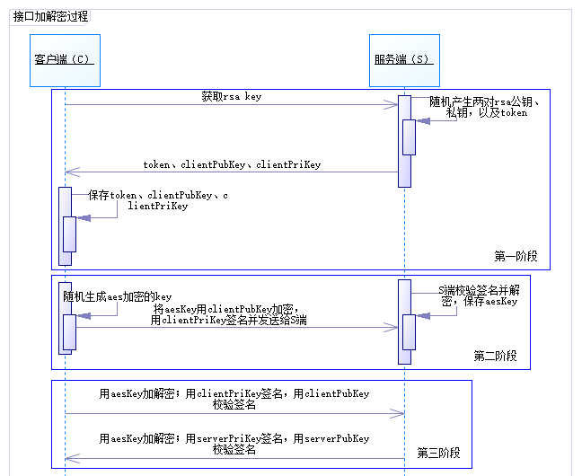
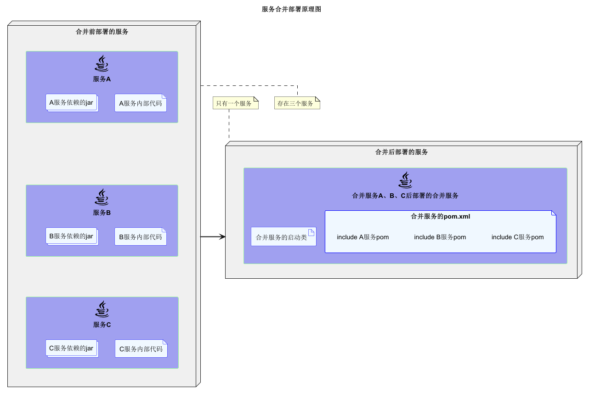

# 一、功能特征
**该框架基于spring cloud。所实现功能如下：**
- 接口文档自动生成（服务启动时通过swagger生成原始json数据，处理后上传至文档服务如showdoc、gitbook等）
- 可以生成mock数据，充分发挥前后端分离的作用
- 部署灵活，服务可合并（合并后服务间通过内部进程通信；分开后通过rpc通信）部署，合并后也可拆分开部署
- 业务无关代码自动生成
- 接口（加密+签名）安全保证
- 业务无关功能（如日志打印、公共配置、常用工具类等）抽象为starter
- 支持多数据源、分表分库、分布式事务
- 支持多语言（国际化）
- 敏感配置信息支持加密
- 单体服务开发接阶段测试不依赖其他服务（挡板测试、关闭eureka、sentinel等）
- 代码安全保护
- 技术栈稳定、实用、易用

示例工程见[smart-cloud-examples](https://github.com/smart-cloud/smart-cloud-examples)

# 二、模块说明

<table>
	<tr>
		<th>模块</th>
		<th>工程名</th>
		<th>说明</th>
	</tr>
 	<tr>
 		<td rowspan=13>smart-cloud-starter</td>
 		<td>smart-cloud-starter-common</td>
 		<td>自定义注解、异常封装、请求响应公共参数、业务相关工具类</td>
 	</tr>
 	<tr>
 		<td>smart-cloud-starter-configure</td>
 		<td>配置信息</td>
 	</tr>
 	<tr>
 		<td>smart-cloud-starter-dubbo</td>
 		<td>日志、参数校验、加密、签名等处理</td>
 	</tr>
 	<tr>
 		<td>smart-cloud-starter-job</td>
 		<td>xxl job封装</td>
 	</tr>
 	<tr>
 		<td>smart-cloud-starter-locale</td>
 		<td>国际化语言</td>
 	</tr>
 	<tr>
 		<td>smart-cloud-starter-log</td>
 		<td>日志封装（log4j2）</td>
 	</tr>
 	<tr>
 		<td>smart-cloud-starter-mock</td>
 		<td>mock工具类、常用mock策略、请求接口mock拦截器</td>
 	</tr>
 	<tr>
 		<td>smart-cloud-starter-mybatis</td>
 		<td>mybatis封装。支持多数据源配置、分库分表（sharding jdbc配置）、分布式事务（seata配置）；通用mapper封装，mapper工具类等;支持通用mapper、mybatis plus。</td>
 	</tr>
 	<tr>
 		<td>smart-cloud-starter-redis</td>
 		<td>redis封装</td>
 	</tr>
 	<tr>
 		<td>smart-cloud-starter-feign</td>
 		<td>feign封装（可拆可合），切面拦截（日志、加密、签名等处理）</td>
 	</tr>
 	<tr>
 		<td>smart-cloud-starter-swagger</td>
 		<td>swagger封装（支持校验注解，swagger文档自动上传文档服务器）</td>
 	</tr>
 	<tr>
 		<td>smart-cloud-starter-test</td>
 		<td>测试相关基类封装</td>
 	</tr>
 	<tr>
 		<td>smart-cloud-starter-web</td>
 		<td>web相关封装。常用注解（如重复提交）、切面（日志、加密、签名等处理）、统一异常处理、参数校验配置</td>
 	</tr>
 	<tr>
 		<td>smart-code-generate</td>
 		<td>-</td>
 		<td>代码生成</td>
 	</tr>
 	<tr>
 		<td>smart-common-pojo</td>
 		<td>-</td>
 		<td>公共java对象</td>
 	</tr>
 	<tr>
 		<td>smart-utility</td>
 		<td>-</td>
 		<td>常用工具类</td>
 	</tr>
</table>

# 三、技术栈

 名称 | 说明 
---|---
[spring boot](https://spring.io/projects/spring-boot/) | 手脚架 
[spring cloud gateway](https://spring.io/projects/spring-cloud-gateway) | 服务网关 
[eureka](https://spring.io/projects/spring-cloud-netflix) | 服务注册 
[spring boot admin](https://github.com/codecentric/spring-boot-admin) | 服务监控 
[openfeign](https://spring.io/projects/spring-cloud-openfeign) | 声明式服务调用 
[sleuth](https://spring.io/projects/spring-cloud-sleuth)、[log4j2](https://logging.apache.org/log4j/2.x/) | 链路追踪、日志 
[mybatis](http://www.mybatis.org/mybatis-3/zh/index.html) 、[mapper](https://github.com/abel533/Mapper)、[mybatis plus](https://github.com/baomidou/mybatis-plus)| ORM 
[seata](https://github.com/seata/seata) | 分布式事务
[sentinel](https://github.com/alibaba/Sentinel) | 限流、熔断降级
[sharding jdbc](https://github.com/apache/incubator-shardingsphere) | 分库分表
[redis](https://redis.io/) | 缓存 
[rocketmq](https://github.com/apache/rocketmq) | 消息队列 
[fastdfs](https://github.com/happyfish100/fastdfs) | 文件存储 
[xxl-job](https://github.com/xuxueli/xxl-job)| 定时任务 
[easyexcel](https://github.com/alibaba/easyexcel) | excel导入导出
[Hibernator-Validator](http://hibernate.org/validator/) | 参数校验 
[mockito](https://site.mockito.org/)、[podam](https://github.com/mtedone/podam) | 单元测试、数据mock
[freemarker](https://freemarker.apache.org/) | 用于代码生成
[swagger](https://swagger.io/)、[gitbook](https://www.gitbook.com/) | 接口文档 
[xjar](https://github.com/core-lib/xjar) | 代码安全 
[jasypt-spring-boot](https://github.com/ulisesbocchio/jasypt-spring-boot) | 配置文件中敏感数据加解密
[Lombok](https://www.projectlombok.org/) | 简化代码 

# 四、接口协议

```
仅支持http get、http post两种方式。
对于http get，请求参数只签名；响应信息加密，且签名。
对于http post，请求响应皆加密，且签名。
```
## （一）约定
```
接口mapping url格式：接口使用端标志/接口类型标志/服务模块名/接口模块名/接口名
如：api/se/user/loginInfo/login

接口使用端标记：
	api：app端使用的接口
	oms：管理后台使用的接口
	rpc：rpc接口
	
http get、http post共同部分，即http headers部分的数据，它包含请求时间戳（默认2分钟内有效）、请求的token、交易流水号、签名等4个自定义字段：
	smart-sign: 109ad1a8e05f8de345e6d780f09b001e97dc3d6fa9bbbe6936edb2b75a81864ac3b0b071e093af001fbffa479217540138b98f6f165e8246dd25a2536649f1f6
	smart-timestamp: 1555778393862
	smart-token: 4c2e22605001000rK
	smart-nonce: eb9f81e7cee1c000
```

**接口类型标志**

签名(sign->s) | 加密(encrypt->e) | 鉴权(auth->a) | url约定
---|---|---|---
需要 | 需要 | 需要 | sea
需要 | 需要 | 不需要 | se
需要 | 不需要 | 需要 | sa
需要 | 不需要 | 不需要 | s
不需要 | 需要 | 需要 | ea
不需要 | 需要 | 不需要 | e
不需要 | 不需要 | 需要 | a
不需要 | 不需要 | 不需要 | o

## （二）Http GET
请求数据由http headers、url查询字符串组成，url查询字符串为实际请求的参数。
如http://localhost:10010/api/open/user/loginInfo/queryById?id=100

## （三）Http POST
请求数据采用json格式，通过流的形式传输。
请求数据由http headers、http body两部分组成，http body部分为请求的实际参数（json格式）。

### 1、请求数据组成
**http body部分**
```
{
    "products": [{
        "buyCount": 1,
        "productId": 4
	}]
}
```

### 2、响应对象Resp组成
```
{
	"head": {
		"transactionId": null,
		"code": "100200",
		"msg": "成功",
		"timestamp": 0
	},
	"body": {
		"id": "2",
		"name": "手机",
		"price": "1200"
	},
	"sign": "109ad1a8e05f8de345e6d780f09b001e97dc3d6fa9bbbe6936edb2b75a81864ac3b0b071e093af001fbffa479217540138b98f6f165e8246dd25a2536649f1f6"
}
```
## （四）加密、签名
### 1、签名、加密的key传递

```
1、C（客户端）请求S（服务端）；
2、S端随机产生两对rsa公钥、私钥（clientPriKey、serverPubKey；clientPubKey、serverPriKey），以及token，并返回token、clientPubKey、clientPriKey给C端；
3、C端保存“token、clientPubKey、clientPriKey”，并随机生成aes加密的key；
4、C端将aesKey用clientPubKey加密，用clientPriKey签名并发送给S端；
5、S端校验签名并解密，保存aesKey；
6、后续C端与S端通信，将会用aesKey加解密；C端用clientPriKey签名，用clientPubKey校验签名；S端用serverPriKey签名，用serverPubKey校验签名。
```
### 2、请求方
#### 1.请求参数
```
Http Get请求方式 ：
1.url查询字符串中的参数以json的格式组装得到查询的json串；
2.sign = RSA签名（“httpmethod + http headers（按自然排序的json串） + url查询json串”组成）

Http Post请求方式 ：
1.将http body部分的数据json化；
2.AES加密body的json串；
3.sign = RSA签名（“httpmethod + http headers（按自然排序的json串） + AES加密body的json串”）
```
#### 2.返回结果
Http Get、Http Post方式响应信息加密、签名相同。
```
1.校验签名是否正确；
2.解密数据
head = AES解密(head的json串)
body = AES解密(body json串)
```

### 3、响应方
#### 1.请求入参
```
Http Get请求方式 ：
校验签名是否正确
sign = RSA签名校验（“httpmethod + http headers（按自然排序的json串） + url查询的json串”组成，sign， 公钥）

Http Post请求方式 ：
1.校验签名是否正确
  sign = RSA签名校验（“httpmethod + http headers（按自然排序的json串） + AES加密body的json串”， 公钥）
2.AES解密body的json串；
```
#### 2.响应结果
Http Get、Http Post请求方式响应信息加密、签名相同。
```
head = AES加密(head的json串)
body = AES加密(body json串)
sign = RSA签名签名(AES加密(head的json串) + AES加密(body json串))
```

# 五、服务合并原理


合并服务只需修改pom.xml，将待合并的服务import进去即可。
# 六、相关说明
## （一）服务合并遇到的问题
单个服务以jar的形式，通过maven引入合并服务中。在单体服务中，feign接口通过http请求；服务合并后，feign接口通过内部进程的方式通信。
### 1、多数据源冲突
```
1. 定义单数据源properties对象SingleDataSourceProperties，多数据源配置数据以Map<String, SingleDataSourceProperties>的形式从yml文件中读取；
2. 手动（通过new方式）构建所有需要的bean对象；
3. 手动将bean注入到容器中。
```
**多数据源配置示例：**
```
smart:
  data-sources:
	product:
	  url: jdbc:mysql://127.0.0.1:3306/demo_product?characterEncoding=utf-8&zeroDateTimeBehavior=convertToNull&allowMultiQueries=true&serverTimezone=Asia/Shanghai
	  username: root
	  password: 123456
	  mapper-interface-location: com.xxx.demo.mall.product.mapper
	  mapper-xml-location: classpath*:com/xxx/demo/mall/product/mybatis/**.xml
	order:
	  url: jdbc:mysql://127.0.0.1:3306/demo_order?characterEncoding=utf-8&zeroDateTimeBehavior=convertToNull&allowMultiQueries=true&serverTimezone=Asia/Shanghai
	  username: root
	  password: 123456
	  mapper-interface-location: com.xxx.demo.mall.order.mapper
	  mapper-xml-location: classpath*:com/xxx/demo/mall/order/mybatis/**.xml
```
### 2、rpc与rpc实现类冲突
```
自定义条件注解封装FeignClient。使其在单体服务时，rpc走feign；在合体服务时，rpc走内部进程通信。
```
### 3、yaml文件的自动加载
```
自定义注解YamlScan，用来加载配置的yaml文件（支持正则匹配）。通过SPI机制，在spring.factories文件中添加EnvironmentPostProcessor的实现类，通过其方法参数SpringApplication获取启动类的信息，从而获取YamlScan注解配置的yaml文件信息。然后将yaml文件加到ConfigurableEnvironment中。
```
### 4、启动类注解冲突
```
自定义条件注解SmartSpringCloudApplicationCondition，只会让启动类标记的启动注解生效。
```
### 5、maven打包异常
```
合体服务打包时，单体服务依赖的包也打进单体服务jar。通过maven profiles解决
```

## （二）接口mock数据
接口通过切面拦截的方式，通过反射可以获取返回对象的所有信息，然后根据对象的属性类型，可以随机生成数据；对于特定要求的数据，可以制定mock规则，生成指定格式的数据。

## （三）测试
### 1、单元测试
利用单元测试，提高测试覆盖率。
### 2、集成测试
```
在集成测试下，关闭eureka，减少依赖。
依赖的服务rpc接口，通过mockito走挡板。
通过事务回滚，还原Test case对DB的修改。
```
### 3、系统测试

## （四）接口文档
接口文档由三个步骤自动生成：
1. 通过swagger自动生成接口文档的json格式数据；
2. 将json格式数据转化为markdown格式；
3. 在服务启动时将markdown格式数据上传（可根据配置的开关控制是否上传）到服务服务器（如[showdoc](https://github.com/star7th/showdoc)、gitbook）。