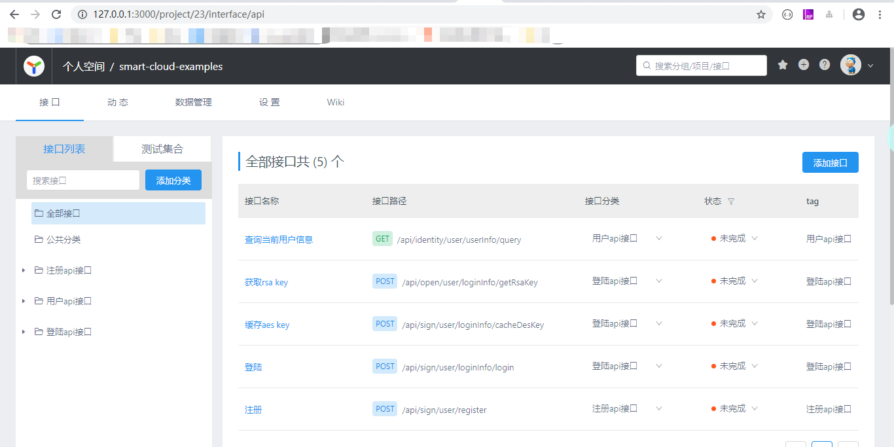
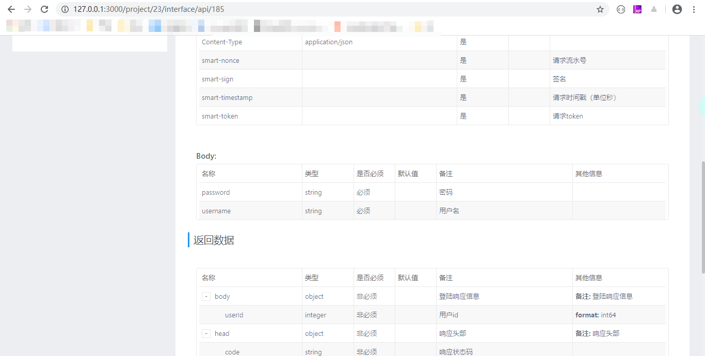

smart cloud
---
[](https://github.com/smart-cloud/smart-cloud/actions/workflows/build.yml)
[](https://codecov.io/gh/smart-cloud/smart-cloud)
[](https://lgtm.com/projects/g/smart-cloud/smart-cloud/context:java)
[](https://www.apache.org/licenses/LICENSE-2.0.html)
[](https://mvnrepository.com/artifact/io.github.smart-cloud/smart-cloud)
[](https://github.com/smart-cloud/smart-cloud/blob/dev/README_EN.md)
[](https://github.com/smart-cloud/smart-cloud#readme)
# features

**A scaffolding based on spring cloud implementation. The implemented functions are as follows:**

- [The interface document is automatically generated (use the idea yapi plugin to upload to the yapi server)](https://github.com/smart-cloud/smart-cloud/blob/dev/README_EN.md#api-documentation)
- [Mock data can be generated to give full play to the role of front-end and back-end separation](https://github.com/smart-cloud/smart-cloud/blob/dev/README_EN.md#interface-mock-data)
- [Flexible deployment, services can be merged (after the merged services communicate through internal processes; after separation, through RPC communication) deployment, and can also be deployed separately after merging](https://github.com/smart-cloud/smart-cloud/blob/dev/README_EN.md#principles-of-service-merger)
- Automatic generation of business-independent code
- [Interface (encryption + signature) security assurance](https://github.com/smart-cloud/smart-cloud-examples#%E4%BA%8C%E6%8E%A5%E5%8F%A3%E5%AE%89%E5%85%A8)
- Business-related functions (such as log printing, public configuration, common tool classes, etc.) are abstracted as starters
- Support multiple data sources, sharding table and sharding database, distributed transactions
- Supports multiple languages (internationalization)
- Sensitive configuration information supports encryption, table privacy field encryption and decryption
- Annotated distributed lock, cache annotations
- mq (rabbitmq) consumption fails, retry through custom annotations (put into delayed queue for re-consumption)
- [Log sensitive data desensitization](https://github.com/smart-cloud/smart-cloud/blob/dev/README_EN.md#desensitization-of-log-data)
- The testing of the single service development phase does not depend on other services (mock test, closing nacos, sentinel, etc.)
- The technology stack is stable, practical and easy to use

See the example project: [smart-cloud-examples](https://github.com/smart-cloud/smart-cloud-examples)

# Module description

```
smart-cloud
├── smart-api-core -- Interface permissions, encryption and decryption, signature and other annotations && user context
│    ├──smart-api-annotation -- Annotation for interface permissions, encryption and decryption, signature, etc.
│    └──smart-user-context -- user context
├── smart-code-generate -- code generation
├── smart-common-pojo -- public object( VO,DTO,BO,DO, etc.)
├── smart-common-web -- web module public processing
├── smart-constants -- constant module
├── smart-exception -- exception module
├── smart-mask -- Sensitive data obfuscation
├── smart-test -- test package
│  ├──smart-cloud-starter-test -- test package
│  ├──smart-cloud-starter-test-mock-rabbitmq -- test rabbitmq module package
│  ├──smart-cloud-starter-test-mock-redis -- test redis module package
│  └──smart-cloud-test-core -- test unit test, integration test package
├── smart-utility -- Tools
└── smart-could-starter -- frame encapsulation
     ├── smart-cloud-starter-configure -- Framework configuration property encapsulation
     ├── smart-cloud-starter-core -- Framework core (custom annotations, exception encapsulation, request and response public parameters, business-related tool classes)
     ├── smart-cloud-starter-elasticsearch-dynamic-datasource -- elasticsearch dynamic data source
     ├── smart-cloud-starter-feign -- feign package (removable and reusable, faceted)
     ├── smart-cloud-starter-global-id -- distributed id generator
     ├── smart-cloud-starter-job -- Scheduled task
     ├── smart-cloud-starter-locale -- international
     ├── smart-cloud-starter-log4j2 -- Log encapsulation (log4j2 encapsulation, support desensitization of log sensitive data)
     ├── smart-cloud-starter-method-log -- 方Method Aspect Log Encapsulation
     ├── smart-cloud-starter-mock -- Mock encapsulation (mock tool classes, common mock strategies, request interface mock interceptors)
     ├── smart-cloud-starter-mp-shardingjdbc -- mybatis plus, dynamic-datasource, shardingjdbc package (supports multiple data sources, sub-database sub-tables, distributed transactions; mapper tool class)
     ├── smart-cloud-starter-mybatis-plus -- mybatis plus, dynamic-datasource encapsulation (supports multiple data sources, distributed transactions; mapper tool class, table privacy field encryption and decryption, etc.)
     ├── smart-cloud-starter-rabbitmq -- rabbitmq encapsulation (consumption failure, automatically put into the delayed queue for re-consumption)
     ├── smart-cloud-starter-redis -- redis encapsulation, custom distributed lock annotation
     └── smart-cloud-starter-web -- web encapsulation (log aspect, exception handling, parameter verification)
```

# technology stack

name | role description
---|---
[spring boot](https://spring.io/projects/spring-boot/) | scaffolding
[spring cloud gateway](https://spring.io/projects/spring-cloud-gateway) | service gateway
[nacos](https://nacos.io/zh-cn/docs/what-is-nacos.html) | Service registration and configuration center
[spring boot admin](https://github.com/codecentric/spring-boot-admin) | service monitoring
[openfeign](https://spring.io/projects/spring-cloud-openfeign)| Declarative service invocation(RPC)
[sleuth](https://spring.io/projects/spring-cloud-sleuth)、[log4j2](https://logging.apache.org/log4j/2.x/) | Link tracking, logs
[mybatis](http://www.mybatis.org/mybatis-3/zh/index.html) 、[mybatis plus](https://github.com/baomidou/mybatis-plus)| ORM
[dynamic-datasource](https://mp.baomidou.com/guide/dynamic-datasource.html)| Multiple data sources
[seata](https://github.com/seata/seata) | Distributed transaction
[sharding jdbc](https://github.com/apache/incubator-shardingsphere) | Sub-library and sub-table
[redis](https://redis.io/)、[embedded-redis](https://github.com/kstyrc/embedded-redis) | Caching, Integration Testing
[sentinel](https://github.com/alibaba/Sentinel) | Current limit, fuse, downgrade
[rabbitmq](https://www.rabbitmq.com/) | message queue
[fastdfs](https://github.com/happyfish100/fastdfs) | Distributed file storage
[xxl-job](https://github.com/xuxueli/xxl-job)| Distributed timing tasks
[easyexcel](https://github.com/alibaba/easyexcel) | excel import and export
[Hibernator-Validator](http://hibernate.org/validator/) | parameter verification
[mockito](https://site.mockito.org/)、[podam](https://github.com/mtedone/podam) | Unit testing, data mocking
[h2](http://www.h2database.com/html/tutorial.html) | database integration test
[embedded-redis](https://github.com/ozimov/embedded-redis) | redis integration test
[rabbitmq-mock](https://github.com/fridujo/rabbitmq-mock) | rabbitmq integration test
[embedded-elasticsearch](https://github.com/allegro/embedded-elasticsearch) | elasticsearch integration test
[freemarker](https://freemarker.apache.org/) | code template generation
[yapi](https://github.com/YMFE/yapi)、[idea yapi upload plugin](https://github.com/smart-cloud/yapi_upload) | api documentation
[jasypt-spring-boot](https://github.com/ulisesbocchio/jasypt-spring-boot) | Encryption and decryption of sensitive data in configuration files
[Lombok](https://www.projectlombok.org/) | Simplified code

# Principles of Service Merger


- To merge services, you only need to modify pom.xml and import the services to be merged.
- rpc interface through custom annotation[SmartFeignClient](https://github.com/smart-cloud/smart-cloud/blob/dev/smart-cloud-starter/smart-cloud-starter-feign/src/main/java/org/smartframework/cloud/starter/rpc/feign/annotation/SmartFeignClient.java)accomplish. When a single service is deployed alone, FeignClient will take effect; when the service provider and service consumer are deployed together, the FeignClient annotation will be invalid, and the rpc interface will be called directly through the implementation class object. For specific logic, see[SmartFeignClientCondition](https://github.com/smart-cloud/smart-cloud/blob/463cc09b6c2f8a0b947f0a2fcc157ee037ba419d/smart-cloud-starter/smart-cloud-starter-feign/src/main/java/org/smartframework/cloud/starter/rpc/feign/condition/SmartFeignClientCondition.java#L32)。

# Related instructions

## Problems encountered with service mergers

A single service is introduced into the merged service through maven in the form of a jar. In a single service, the feign interface requests through http; after the services are merged, the feign interface communicates through internal processes.

### Bean name conflict

````
After different services are merged together, there will be a problem of bean name conflict. Resolved by custom bean name generation rules.
````

### rpc conflicts with rpc implementation class

```
Custom conditional annotations encapsulate FeignClient. When it is used as a single service, rpc uses feign; when it is combined service, rpc uses internal process communication.
```

### Automatic loading of yaml files

```
Custom annotation YamlScan, used to load the configured yaml file (supports regular matching). Through the SPI mechanism, the implementation class of EnvironmentPostProcessor is added to the spring.factories file, and the information of the startup class is obtained through its method parameter SpringApplication, thereby obtaining the information of the yaml file configured by the YamlScan annotation. Then add the yaml file to the ConfigurableEnvironment.
```

### Startup class annotation conflict

```
The custom condition annotation SmartSpringCloudApplicationCondition will only make the startup annotation marked by the startup class take effect.
```

### maven packaging exception

```
When the combined service is packaged, the packages that the single service depends on are also entered into the single service jar. Solved by maven profiles
```

## Desensitization of log data

```
1. Cut in from the log side, customize the label, and perform desensitization processing when printing the log;
2. Customize the serializer of jackson; when printing the log, use the customized serializer;
3. Obtain the MaskRule annotation information of the log incoming parameters through reflection, and finally intercept and replace the string according to the annotation rules.
```

## Interface mock data

The interface can obtain all the information of the returned object through reflection, and then randomly generate data according to the attribute type of the object; for the data required by specific requirements, you can formulate mock rules to generate data in a specified format.

## Test

### Unit Test

Improve test coverage with unit testing.

### Integration Testing

>- Under integration tests, turn off nacos to reduce dependencies.
>- Depends on the service rpc interface, go baffle through mockito.
>- The redis layer uses embedded-redis for integration testing.
>- rabbitmq layer uses rabbitmq-mock for integration testing
>- The database layer uses h2 for integration testing (there are two other schemes: scheme 1 restores the modification of the DB by the test case through transaction rollback; scheme 2 deletes the relevant table before the test case is executed).

### System Test

## api documentation

### The interface documentation is automatically generated by the following steps:

Through the [idea yapi upload plugin](https://github.com/smart-cloud/yapi_upload) plugin, upload to [yapi server](https://github.com/YMFE/yapi)

### Interface document renderings

#### summary



#### Details



# Error code description

module | code | message
---| ---|---
smart-constants | 200 | success
smart-constants | 101 | Verification failed
smart-constants | 102 | Data does not exist
smart-constants | 103 | Data already exists
smart-constants | 400 | Signature error
smart-constants | 401 | Unauthorized access
smart-constants | 404 | request url error
smart-constants | 408 | Request timed out
smart-constants | 409 | duplicate commit
smart-constants | 412 | Incomplete parameters
smart-constants | 415 | Request method not supported
smart-constants | 416 | Request type not supported
smart-constants | 417 | Failed to acquire lock
smart-constants | 418 | Upload file size exceeds limit
smart-constants | 419 | The current session has expired, please log in again
smart-constants | 500 | Server exception
smart-constants | 501 | Failed to get Request
smart-constants | 502 | Failed to get Response
smart-constants | 503 | rpc request failed
smart-constants | 504 | rpc returns abnormal results
smart-cloud-starter-web | 2001 | The parameter object to be verified cannot be null
smart-cloud-starter-elasticsearch-dynamic-datasource | 3001 | elasticsearch ds key does not exist
smart-cloud-starter-elasticsearch-dynamic-datasource | 3002 | elasticsearch data source not found
smart-cloud-starter-elasticsearch-dynamic-datasource | 3003 | elasticsearch dynamic data source properties are not configured