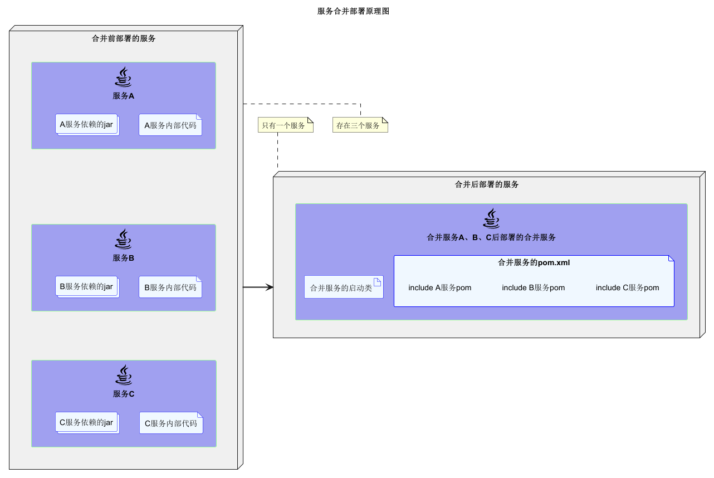
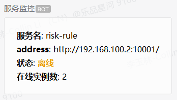
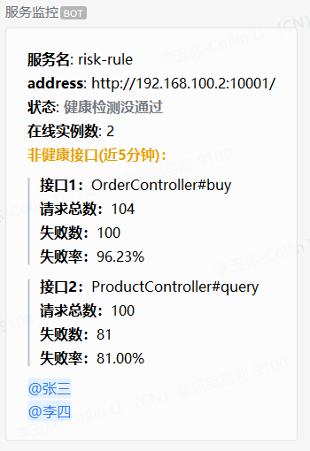
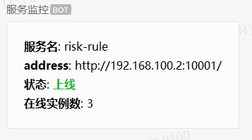
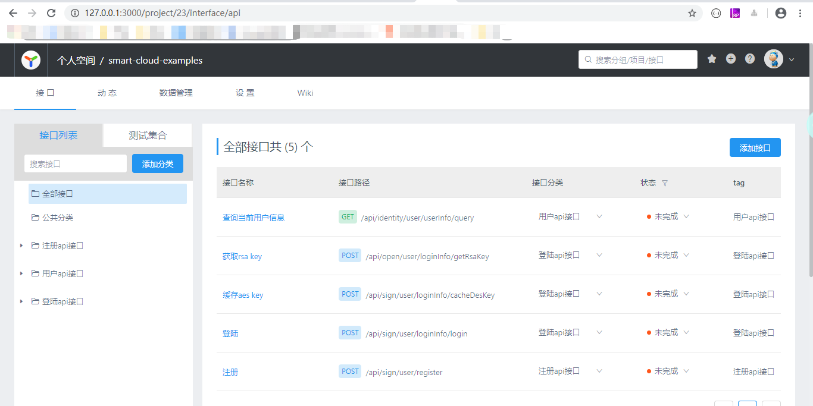
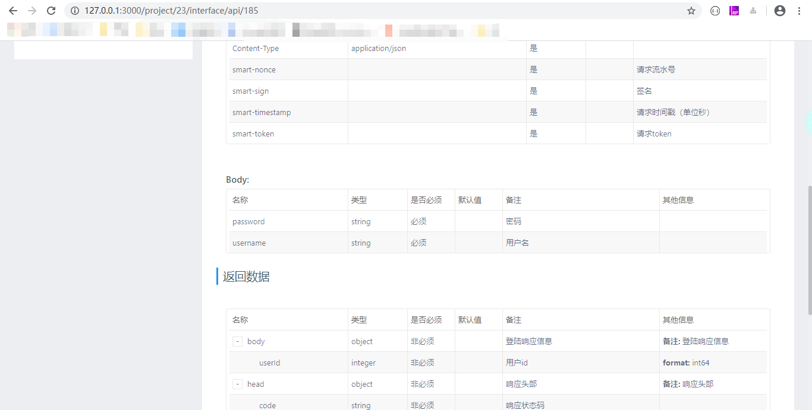

<p align="center">
  <h1 align="center">☁️ Smart Cloud</h1>
  <p align="center">
    <strong>A One-Stop Spring Cloud Microservices Scaffolding — Build Microservices Like Lego</strong>
  </p>
  <p align="center">
    Out-of-the-Box · Merge & Split · Security-Enhanced · Full-Stack Observability
  </p>
</p>

---

<p align="center">
  <a href="https://github.com/smart-cloud/smart-cloud/actions/workflows/build.yml"></a>
  <a href="https://codecov.io/gh/smart-cloud/smart-cloud"></a>
  <a href="https://github.com/smart-cloud/smart-cloud/blob/dev/LICENSE"></a>
  <a href="https://mvnrepository.com/artifact/io.github.smart-cloud/smart-cloud"></a>
  <a href="https://github.com/smart-cloud/smart-cloud"></a>
  <a href="https://github.com/smart-cloud/smart-cloud/blob/dev/README_EN.md"></a>
  <a href="https://github.com/smart-cloud/smart-cloud#readme"></a>
</p>

---

## 🌟 Why Smart Cloud?

| Pain Point | Smart Cloud Solution |
|------------|---------------------|
| Splitting microservices too early is costly; too late hurts performance | **Merge & Split** — merge services by business domain in early stage to save costs; split them when traffic grows to handle high QPS. Merged deployment uses in-process calls; split deployment uses Feign RPC. Switch with one line in pom.xml |
| API docs are costly to maintain | **Auto-generate YAPI docs** — upload to YAPI Server with one click via IDEA plugin |
| Frontend-backend integration is slow | **Built-in Mock Engine** — auto-generate responses by type/rules |
| Sensitive data leak risks | **Full-stack desensitization** — log masking + config encryption + field encryption (multi-key) |
| Production issues discovered late | **Real-time monitoring & alerts** — slow APIs / error APIs / offline services, instant WeCom notifications |
| Infrastructure onboarding is tedious | **20+ Starter components** — assemble capabilities like Lego blocks |

> 📦 Example project: [smart-cloud-examples](https://github.com/smart-cloud/smart-cloud-examples) — up and running in 5 minutes

---

## ✨ Key Features

### 🚀 Developer Productivity
- **Auto API Documentation** — IDEA YAPI plugin one-click upload to YAPI Server
- **Mock Data Engine** — random data by return type, custom mock rules supported
- **Code Generation** — auto-generate boilerplate code (VO/DTO/Mapper, etc.)
- **API Versioning** — manage multiple API versions effortlessly

### 🔒 Security Enhancement
- **API Encryption & Signature** — auto encrypt/decrypt requests/responses with tamper-proof signature
- **Config Encryption** — encrypt configuration files via Jasypt
- **Field-Level Encryption** — auto encrypt/decrypt privacy fields with multi-key support
- **Log Desensitization** — annotation-driven, auto-mask sensitive data in log output

### 🏗️ Architecture Flexibility
- **Merge & Split Services** — merge by business domain to save costs early on; split for high traffic later. Merged (in-process) ⇄ split (RPC), flexible switching
- **Multi-DataSource & Sharding** — MyBatis-Plus + Dynamic-DataSource + ShardingSphere
- **Rate Limiting & Circuit Breaking** — Sentinel integration with dynamic refresh via config center
- **MQ Retry on Failure** — custom annotation for delayed queue re-consumption

### 📊 Full Observability
- **Service Monitoring** — Spring Boot Admin (status/GC/threads/memory/CPU/Tomcat)
- **API Monitoring** — slow API / error API real-time monitoring + consecutive failure circuit breaking
- **WeCom Alerts** — instant notification for service offline / health check failure, supports @mention
- **Full-Stack Logging** — Web/Feign/Method/MyBatis/MQ logs, configurable levels
- **Request Tracing** — HTTP request input/output params & timing

### 🧪 Testing Friendly
- **Standalone Testing** — disable Nacos/Sentinel, mock RPC interfaces, develop independently
- **Integration Test Suite** — H2 database + Embedded Redis + RabbitMQ Mock
- **Unit Test Utilities** — Mockito + Podam data mocking, improve coverage

---

## 🚀 Quick Start

### 1. Add Parent Dependency

```xml
<parent>
    <groupId>io.github.smart-cloud</groupId>
    <artifactId>smart-cloud</artifactId>
    <version>${latest-version}</version>
</parent>
```

### 2. Add Starters as Needed

```xml
<!-- Web Service -->
<dependency>
    <groupId>io.github.smart-cloud</groupId>
    <artifactId>smart-cloud-starter-web</artifactId>
</dependency>

<!-- MyBatis-Plus ORM -->
<dependency>
    <groupId>io.github.smart-cloud</groupId>
    <artifactId>smart-cloud-starter-mybatis-plus</artifactId>
</dependency>

<!-- Redis Cache & Distributed Lock -->
<dependency>
    <groupId>io.github.smart-cloud</groupId>
    <artifactId>smart-cloud-starter-redis</artifactId>
</dependency>
```

### 3. Full Working Example

👉 Head to [smart-cloud-examples](https://github.com/smart-cloud/smart-cloud-examples) for a complete, ready-to-run example project.

---

## 🧩 Module Structure

```
smart-cloud
├── smart-api-core                          # API permissions, encryption, signature annotations & user context
│   ├── smart-api-annotation                #   API permissions, encryption, signature annotations
│   └── smart-user-context                  #   User context
├── smart-code-generate                     # Code generation
├── smart-common-pojo                       # Common objects (VO, DTO, BO, DO)
├── smart-common-web                        # Web module common processing
├── smart-constants                         # Constants
├── smart-exception                         # Exception module
├── smart-design-pattern-utility            # Design pattern utilities
├── smart-utility                           # Common utilities
├── smart-test                              # Testing utilities
│   ├── smart-cloud-starter-test            #   Test base
│   ├── smart-cloud-starter-test-mock-rabbitmq  # RabbitMQ Mock
│   ├── smart-cloud-starter-test-mock-redis     # Redis Mock
│   └── smart-cloud-test-core               #   Unit / integration test utilities
└── smart-cloud-starter                     # 🧱 Starter Components
    ├── smart-cloud-starter-api-version     #   API versioning
    ├── smart-cloud-starter-configure       #   Framework config properties
    ├── smart-cloud-starter-core            #   Core (annotations, exceptions, request/response)
    ├── smart-cloud-starter-elasticsearch-dynamic-datasource  # ES dynamic datasource
    ├── smart-cloud-starter-feign           #   Feign (merge/split, aspects)
    ├── smart-cloud-starter-global-id       #   Distributed ID generator
    ├── smart-cloud-starter-job             #   Scheduled tasks (XXL-Job)
    ├── smart-cloud-starter-locale          #   Internationalization
    ├── smart-cloud-starter-log4j2          #   Log4j2 logging (with desensitization)
    ├── smart-cloud-starter-log-mask        #   Log desensitization
    ├── smart-cloud-starter-logback         #   Logback logging (with desensitization)
    ├── smart-cloud-starter-method-log      #   Method aspect logging
    ├── smart-cloud-starter-mock            #   Mock (utilities, strategies, interceptors)
    ├── smart-cloud-starter-mp-shardingjdbc #   MyBatis-Plus + sharding
    ├── smart-cloud-starter-mybatis-plus    #   MyBatis-Plus + multi-datasource
    ├── smart-cloud-starter-rabbitmq        #   RabbitMQ (auto-retry on failure)
    ├── smart-cloud-starter-rate-limit      #   Rate limiting (Sentinel)
    ├── smart-cloud-starter-redis           #   Redis + distributed lock
    ├── smart-cloud-starter-static-discovery    # Static service discovery
    ├── smart-cloud-starter-trace-debug     #   Request tracing (I/O + timing)
    ├── smart-cloud-starter-web             #   Web (logging aspect, exception handling, validation)
    └── smart-cloud-starter-monitor         #   📊 Monitoring
        ├── smart-cloud-monitor-common      #     Common monitoring code
        ├── smart-cloud-starter-monitor-api #     Slow API / error API monitoring
        └── smart-cloud-starter-monitor-admin   # Spring Boot Admin + WeCom alerts
```

---

## 🛠️ Tech Stack

| Category | Technology | Purpose |
|----------|-----------|---------|
| **Framework** | [Spring Boot](https://spring.io/projects/spring-boot/) | Scaffolding |
| | [Spring Cloud Gateway](https://spring.io/projects/spring-cloud-gateway) | API Gateway |
| | [Nacos](https://nacos.io/en/docs/what-is-nacos.html) | Service Registry & Config Center |
| **Service Calls** | [OpenFeign](https://spring.io/projects/spring-cloud-openfeign) | Declarative RPC |
| | [Sentinel](https://github.com/alibaba/Sentinel) | Rate Limiting & Circuit Breaking |
| **Data Layer** | [MyBatis](http://www.mybatis.org/mybatis-3/en/index.html) + [MyBatis-Plus](https://github.com/baomidou/mybatis-plus) | ORM |
| | [Dynamic-DataSource](https://mp.baomidou.com/guide/dynamic-datasource.html) | Multi-DataSource |
| | [ShardingSphere](https://github.com/apache/incubator-shardingsphere) | Sharding |
| | [Redis](https://redis.io/) | Cache & Distributed Lock |
| **Messaging** | [RabbitMQ](https://www.rabbitmq.com/) | Async Messaging |
| **Monitoring** | [Spring Boot Admin](https://github.com/codecentric/spring-boot-admin) | Service Monitoring |
| | [Sleuth](https://spring.io/projects/spring-cloud-sleuth) | Distributed Tracing |
| **Tools** | [XXL-Job](https://github.com/xuxueli/xxl-job) | Distributed Task Scheduling |
| | [EasyExcel](https://github.com/alibaba/easyexcel) | Excel Import/Export |
| | [FastDFS](https://github.com/happyfish100/fastdfs) | Distributed File Storage |
| | [Jasypt](https://github.com/ulisesbocchio/jasypt-spring-boot) | Config Encryption |
| | [Lombok](https://www.projectlombok.org/) | Code Simplification |
| **Testing** | [Mockito](https://site.mockito.org/) + [Podam](https://github.com/mtedone/podam) | Unit Tests & Data Mock |
| | [H2](http://www.h2database.com/html/tutorial.html) | DB Integration Tests |
| | [Embedded Redis](https://github.com/ozimov/embedded-redis) | Redis Integration Tests |
| | [RabbitMQ Mock](https://github.com/fridujo/rabbitmq-mock) | MQ Integration Tests |
| **Docs** | [YAPI](https://github.com/YMFE/yapi) + [IDEA Plugin](https://github.com/smart-cloud/yapi_upload) | Auto API Documentation |
| **Code Gen** | [FreeMarker](https://freemarker.apache.org/) | Template Engine |

---

## 🔄 Service Merge & Split

Smart Cloud's most distinctive feature: **services can be merged or split at will**.

> In the early stage of a new project, multiple services can be merged by business domain to save infrastructure costs. As the business grows with increasing users and higher QPS, services can be split for independent deployment and elastic scaling.



- **Merged deployment**: add service dependencies in `pom.xml` — calls automatically switch to in-process
- **Split deployment**: each service runs independently — communicates via Feign RPC
- **Auto switching**: via [SmartFeignClient](https://github.com/smart-cloud/smart-cloud/blob/dev/smart-cloud-starter/smart-cloud-starter-feign/src/main/java/org/smartframework/cloud/starter/rpc/feign/annotation/SmartFeignClient.java) annotation + [condition check](https://github.com/smart-cloud/smart-cloud/blob/463cc09b6c2f8a0b947f0a2fcc157ee037ba419d/smart-cloud-starter/smart-cloud-starter-feign/src/main/java/org/smartframework/cloud/starter/rpc/feign/condition/SmartFeignClientCondition.java#L32) — no code changes needed

### Key Problems Solved in Merged Deployment

| Problem | Solution |
|---------|---------|
| Bean name conflicts | Custom bean name generation rules |
| RPC interface vs implementation conflicts | `SmartFeignClient` conditional annotation — uses in-process calls when merged |
| YAML config auto-loading | `@YamlScan` annotation + `EnvironmentPostProcessor` SPI |
| Startup class annotation conflicts | `SmartSpringCloudApplicationCondition` conditional annotation |
| Maven packaging issues | Maven Profiles to control dependency scope |

---

## 📊 Monitoring & Alerts

Monitor service status via Spring Boot Admin, extend Actuator endpoints to track API health, and send WeCom notifications.

- **Service offline**: check GitLab job history; if no tag jobs in the last 30 minutes (configurable), send notification and @mention
- **API errors**: sliding window failure rate calculation; health check fails when threshold exceeded
- **Consecutive failure circuit breaking**: trigger alert on consecutive API failures

| Service Offline | Health Check Failed | Service Online |
|:---:|:---:|:---:|
|  |  |  |

---

## 🔒 Log Desensitization

```
1. Custom desensitization tags — auto-trigger masking when logging
2. Custom Jackson serializer — dedicated serializer for log output
3. Reflect @MaskRule annotations — mask strings per annotation rules
```

---

## 📄 API Documentation

Upload to [YAPI Server](https://github.com/YMFE/yapi) with one click via [IDEA YAPI Upload Plugin](https://github.com/smart-cloud/yapi_upload).

| Overview | Detail |
|:---:|:---:|
|  |  |

---

## 📖 Error Codes

| Module | Code | Description |
|--------|:----:|-------------|
| smart-constants | 200 | Success |
| | 101 | Validation failed |
| | 102 | Data not found |
| | 103 | Data already exists |
| | 400 | Signature error |
| | 401 | Unauthorized access |
| | 404 | Request URL error |
| | 408 | Request timeout |
| | 409 | Duplicate submission |
| | 412 | Incomplete parameters |
| | 413 | Attribute not configured |
| | 415 | Request method not supported |
| | 416 | Request type not supported |
| | 417 | Failed to acquire lock |
| | 418 | Upload file size exceeds limit |
| | 419 | Session expired, please log in again |
| | 420 | Request JSON parse error |
| | 421 | Rate limit exceeded |
| | 500 | Server error |
| | 501 | Failed to get Request |
| | 502 | Failed to get Response |
| | 503 | RPC request failed |
| smart-cloud-starter-web | 2001 | Validation target cannot be null |
| smart-cloud-starter-elasticsearch-dynamic-datasource | 3001 | ES DS key not found |
| | 3002 | ES data source not found |
| | 3003 | ES dynamic datasource properties not configured |

---

## 🤝 Contributing

Star ⭐, Fork 🍴, and PR 🔧 are welcome!

1. Fork this repository
2. Create your feature branch (`git checkout -b feature/AmazingFeature`)
3. Commit your changes (`git commit -m 'Add some AmazingFeature'`)
4. Push to the branch (`git push origin feature/AmazingFeature`)
5. Open a Pull Request

---

## ⭐ Star History

[](https://star-history.dera.page/#smart-cloud/smart-cloud&Date)

---

## 📜 License

This project is licensed under the [Apache License 2.0](LICENSE).
